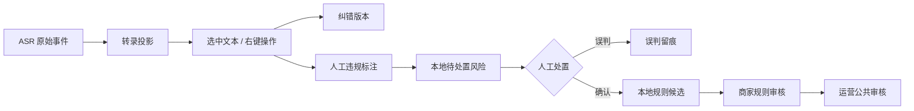

# 转录文本复核与漏判治理

## 目标

实时转录不是一次性结果，而是可复核的事实流。中控人员可以从最近的转录片段中选择一段文字，纠正识别错误，或把漏判的违规词、违规句记录为待处置风险。任何人工标注都先落本地，不会直接写入公共规则库。

## 数据边界

- `session_events` 保留 ASR、纠错、说话人标注、违规标注、处置和历史复核编辑的追加式事实，禁止覆盖原始事件；处置使用 `transcript.annotation_resolved`，历史修改使用 `review.edited`。
- `transcript_projections` 只保存当前显示版本，并保留 `original_text` 与修订号；纠错后会撤销本场上传批准。
- `transcript_annotations_json` 保存选区、字符位置、词级/句级类型、说明、认证操作人和处置状态；投影重建会按处置事件恢复 `confirmed` / `dismissed`，不会回到 `pending`。
- 人工标注会生成一个带 `annotationId` 的 `ComplianceResult` 和本地 `ComplianceFinding`。它使用独立的合成 finding key，因此不会覆盖同一片段已有的豆包结果，也不会因为同一片段已有风险而静默。
- 只有确认 finding 才能调用现有规则治理模块创建本地规则；句级和上下文标注进入语义规则审核，词级标注进入本地快速规则审核。

## 前端交互

1. 转录列表按时间倒序显示，最新片段置顶；列表仍保留滚动容器，新增片段不会把操作者带到页面底部。
2. 选中文字后右键打开菜单：纠错/替换、标注违规词、标注违规句。前端通过 DOM Range 保存选区的真实字符偏移，重复出现的相同词也能定位到正确一处；未选中文字时默认使用整段作为证据，避免右键操作无效。
3. 点击说话人徽标可选择“主播 / 其它人”并填写姓名。若存在 `speakerId`，后续同一声音沿用该身份和姓名；历史复核页也可修改。
4. 标注保存后风险面板显示完整原话、命中片段、置信度和待处置状态；确认成规则、标记误判仍在风险规则控制台完成。

## 一致性与失败策略

- 纠错会递增片段修订号，并重新运行本地规则和豆包复核；旧的异步结果因 `segmentRevision` 不匹配而丢弃。若纠正的是较早片段，只更新该片段的合规记录，不更新当前商品的风险主卡或主播提词。
- 规则确认、误判和公共提交均使用现有权限和审计链路。公共库仍需要运营账号二次采纳。
- 数据库使用 WAL；事件、投影、风险发现和复核状态在同一事务中更新。页面刷新后由事件序列和 SQLite 投影恢复。
- 豆包超时、网络错误或额度不足只影响补充语义结果，人工标注、本地规则和转录显示不受影响。

## 后续扩展

- 将 `transcript_annotations_json` 迁移为独立 `transcript_annotations` 表，支持按主播、商品、规则包版本和处置状态分页检索。
- 为选区保存 ASR 时间范围，方便从本地音频回放对应证据。
- 在规则控制台增加“同类证据聚合”，达到多次人工确认后再推荐提交运营公共审核，减少单条误标造成的噪声。
